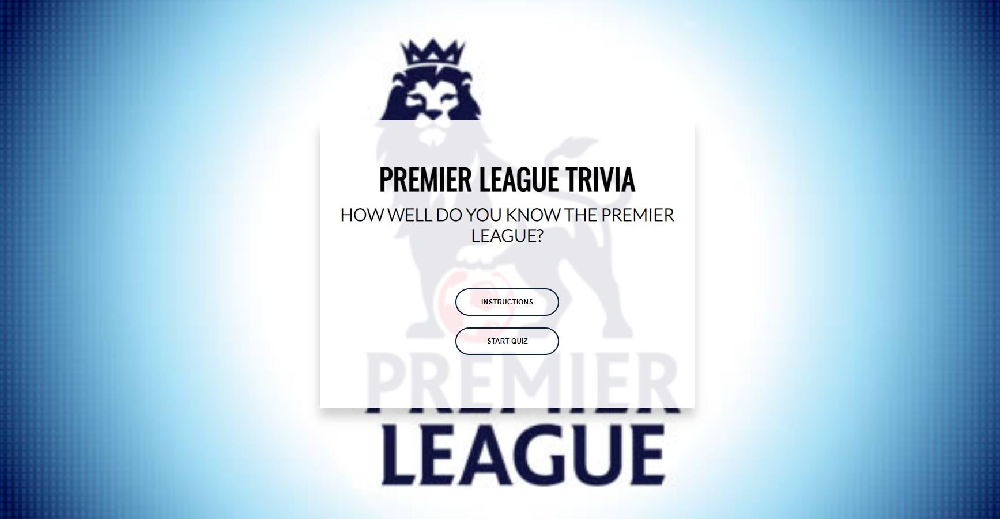
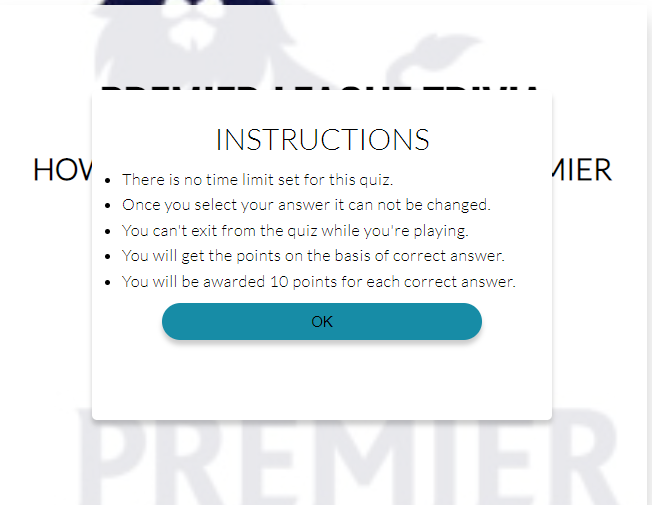
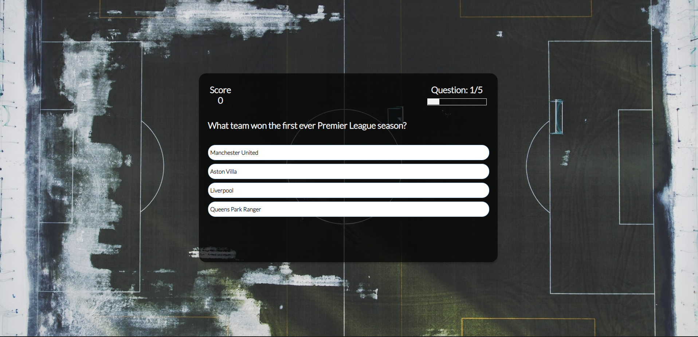

# English Premier League Quiz

Test your Premier League Knowledge with this quiz!

Premier League is the most competitive and most-watched league in the world, broadcast in 212 territories to 643 million homes and a potential TV audience of 4.7 billion people.

During the lockdown quizes became popular where the friends and family started playing quiz through video conferencing like skype and many companies started playing quiz as part of the team building exercise. This gave me an idea to develop an interactive quiz application for the Premier league where users can play on their own to improve their premier league knowledge. 

#### [View the deployed website!](https://unkhan87.github.io/premier-league-trivia/)

## User Experience

### User Stories

#### First Time Visitor

* I want to improve my knowledge about premier league. I want to be able to play at any time, anywhere.
* Easy to navigate.
* Can keep track of my score.
* I want the application to be responsive to my device.
* I would like to keep a track of question numbers.

#### Returning User Goals

* I want the questions to appear in a random order.

## Design

### Colour Scheme

* As the website pages have the background image, I wanted to keep the coulour scheme balanced on the website so as to not overhelm users. In order to avoid text overlayiong on the background I have created shadow boxes that holds the important aspects of the website like questions, score area and instructions box. Blue, white and black colours are generally used in the English Premier League logo, so I have designed my initial colour pallete keeping this in mind.

* For the correct and incorrect choices I went to for the tradiotional green color for the correct choices and red color for the incorrect choice.

### Typography
When choosing the fonts for my website my aim was to keep it simple. On the website there are two fonts getting used that I have imported from Google fonts.

* For all the H1 headings I have used Oswald. As its an eye-catching and ideal for the headers becuase of its boldness.
* For all the main body I have chosen Lato font because of teh balance it strikes between gentle curves and sturdy design, this font gives off a powerful yet welcomng vibe.  

## Features 

The website have been designed to be used across all divce sizes and have been divided into three main sections.

### Home Page
* This page provides user with a brief introduction about the quiz a background image of the English Premier Logo with two call to action buttons (Instructions and Home).
* The buttons also have a hover effect in order to provide feedback to the user for a better user experience.

#### Main Buttons
* The instructions buttons open the rules of the quiz pop up box. And then select OK button within the instructions box to come out of it and back to the home page.

* The start quiz button work as a link to the game section.

### Quiz Page
* The quiz page contains quiz area and the background image.

* **Score Area**
    - Keep track of the points obtained by the player and displays the current score to the player.

* **Question Tracker**
    - Display the question number to the user and let them know how many questions are left to complete the quiz.

* **Progress Tracker**
    - Visual display for the user to bring more interactivity.

* **Question Display Area**
    - Display questions for the user.

* **Option Section**
    - Display choices for the user to select from. The choices have a got a hover effect that changes the color for option they are selecting and once selected the option will dynamically change its colour to red(incorrect) or green(correct).

### Summary Page

* The summary page displays the final score and update the message for the user depending on whats their score is.
* The page also contains two buttons.
    - Reset Quiz Button: This button close the quiz summary page and restart the game again for the user.
    - End Quiz Button: This button takes you back top the main page of the quiz.

## Technologies Used

### Languages Used
* [HTML5](https://en.wikipedia.org/wiki/HTML5)
* [CSS3](https://en.wikipedia.org/wiki/CSS)
* [Javascript](https://en.wikipedia.org/wiki/JavaScript)

### Frameworks, Libraries and Programs Used

* [Google Fonts](https://fonts.google.com/)
    - Google Fonts was used to import the fonts Oswald and Lato into the style.css file. These fonts were used throughout the site.

* [GitPod](https://gitpod.io/)
     - GitPod was used for writing code, committing, and then pushing to GitHub.

* [GitHub](https://github.com/)
     - GitHub was used to store the project after pushing.

* [Chrome DevTools](https://developer.chrome.com/docs/devtools/)
    - Chrome DevTools was used during development process for code review and to test responsiveness.

* [W3C Markup Validator](https://validator.w3.org/)
    - W3C Markup Validator was used to validate the HTML code.

* [W3C CSS Validator](https://jigsaw.w3.org/css-validator/)
    - W3C CSS Validator was used to validate the CSS code.

* [JSHint](https://jshint.com/) 
    - The JSHints JavaScript Code Quality Tool was used to validate the site's JavaScript code.

## Testing

### Testing User Stories

* As a player, I want the game's website to be easy to navigate.

    - The website offers an intuitive structure for the player to find easily the information or section they are looking for.

* As a player, I want the game to be fun and engaging.

    - Premier league bakground have been displayed on the main page of the website.

    - The site's color design has been inspired by the colors used by the English Premier League.
    
    - The game area display the the question tracker, score area, progress bar, questions and 4 choices.

    - The score is being tracked and displayed on the top of the game section.

    - Question tracker and progress bar helps the user to track their progress.

    - The choices section in the question area have also got a hover effect that changes color in order to help the user.

* As a player, I want to have easy access to the game rules.

    - A quiz rules option have been displayed on the home page of the website.

    - The instructions box popup directly on the home page allowing them to view the instructions and would not be re-directed to a different page. 

* As a player, I want the game controls to be easy to access during the game.

    - All the game buttons are being provided on the bottom of the game section for easy access.

    - Through out the website the buttons have got a hover effect that helps the users to see what button they are about to click.

* As a player, I want to track my progress and see my score during and after the game.

    - Score is always available on the top of the game section.

    - Question tracker and progress bar are always available on top of the question in order for the user to keep track.

    - Total score with a dynamic message gets displayed on the summary page of the quiz.

### Browser Testing

Other than Google Chrome I have tested this application on Microsoft Edge and Mozilla Firefox.

### Performance Testing

[Lighthouse](https://developers.google.com/web/tools/lighthouse/) tool was used to check the performance of my application. Please see the results below.

### Code Validation

I have used three online resources to validate the application's code. 

* [W3C HTML Validator](https://validator.w3.org/) to test HTML code.
* [W3C CSS Validator](https://jigsaw.w3.org/css-validator/) to validate CSS code.
* [JSHint Validator](https://jshint.com) to validate JS code.

Please see the results below.

---

---

---

## Deployment

* This website was developed using [GitPod](https://www.gitpod.io/), which was then committed and pushed to GitHub using the GitPod terminal.

### GitHub Pages

* Here are the steps to deploy this website to GitHub Pages from its GitHub repository:

    1. Log in to GitHub and locate the [GitHub Repository](https://github.com/).

    2. At the top of the Repository, locate the Settings button on the menu.

    3. Scroll down the Settings page until you locate the Pages section.

    4. Under Source, click the dropdown called None and select Master Branch.

    5. The page will refresh automatically and generate a link to your website.

## Credits

To complete this project I used Code Institute student template: [gitpod full template](https://github.com/Code-Institute-Org/gitpod-full-template)

### Learning Resources

As javascript was a brand new coding language for me initially I struggle to put the initial project structure in place and have to get ideas and learn new feature in javascript that I can adapt in my project.

    * [w3schools.com](https://www.w3schools.com) - I used W3Schools to learn arrow functions how to manipulate DOM and forEach method from this reource.

    * [MDN Web Docs](https://developer.mozilla.org/en-US/) - I was strugling how to show user end score on the end page until I found a feature called 'localStorage' on this website.

### Image Resources

* Main background image - https://www.google.com/url?sa=i&url=https%3A%2F%2Fawfulannouncing.com%2F2016%2Fthe-premier-league-is-dumping-their-lion-logo.html&psig=AOvVaw1sl3x7pSXVgnIhrSDY6YfK&ust=1653635097507000&source=images&cd=vfe&ved=0CAwQjRxqFwoTCMi-6v3M_PcCFQAAAAAdAAAAABAI

* Summary Page Background Image - I would like to thank Joshua Hoehne for the image. https://unsplash.com/photos/Rrcyop6jvDA.

* Quiz Page Background Image - I would like to thank Mathias Herheim for the image - https://unsplash.com/photos/mzwMBFUOECQ.

### Help and Guidance

* I would like to thank my mentor (Marcel) for his guidance and invaluable input in completing my project.